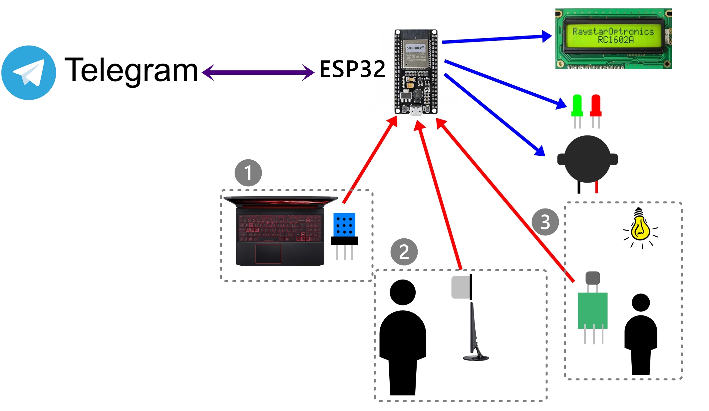

# Desk-Assistant
A simple IoT arduino project using ESP32-Dev Board and Telegram. Desk Assistant is a monitoring on eye's health, keeping the user at a certain distance into the monitor and also monitoring light intensity in the room.

Features :
1. Monitoring and giving notification via LED, buzzer, and telegram bot of face's distancion from monitor
2. Monitoring and giving notification via LED, buzzer, and telegram bot of room's light intensity
3. Monitoring and giving notification via LED and telegram bot of device's temperature
4. Remembering for rest every 30 minutes of working.

Device and tools needed :
1. ESP32-Dev Board (1)
2. HC-SR04 (1)
3. KY-018 (1)
4. DHT11 (1)
5. LED (2 Red + 2 Green)
6. Resistor (220 ohm 2 pieces)
7. LCD I2C (Dimension : 16x2 1 Piece)
8. Breadboard (1)
9. USB Cable Type B (1)
10. Jumper Male to Female (±20)
11. Jumper Male to Male (±20)

Software needed :
1. Arduino IDE (Or any arduino IDE software do you have)
2. Telegram Desktop

Languange : C++

Wiring Diagram :

Note :
* You need to install additional library such as DHT11, Accelerometer, etc.
* You need to create your own telegram bot first.
Maybe this tutorial could help you a little.
https://youtu.be/wP2J5BaQIWs
* You need of having a good internet connection for a better project experience in this case

Explanation :
1. The DHT11 should be placed near your device air circulation.
2. The Accelerometer should be placed at the top of your monitor to keep it detecting your face
3. The Photoresistor or LDR should be placed far from your monitor to avoid it calculating your monitor light intensity instead of room intensity.
The telegram bot could use for sending command to turn or off the buzzer if needed
The telegram bot would be the main notification using the internet connection
The LED and buzzer would be the secondary notification

References :
[1] 	J. W. Leksono, Modul Belajar Arduino Uno, Jombong: LPPMUNHASY, 2019. 
[2] 	M. C. T. Manullang, A. Saputra, D. Sipangkar, A. D. G. Bangun and A. M. Ardhi, Modul Hands On (Code References), Lampung Selatan: Teknik Informatika, Institut Teknologi Sumatera, 2021.
